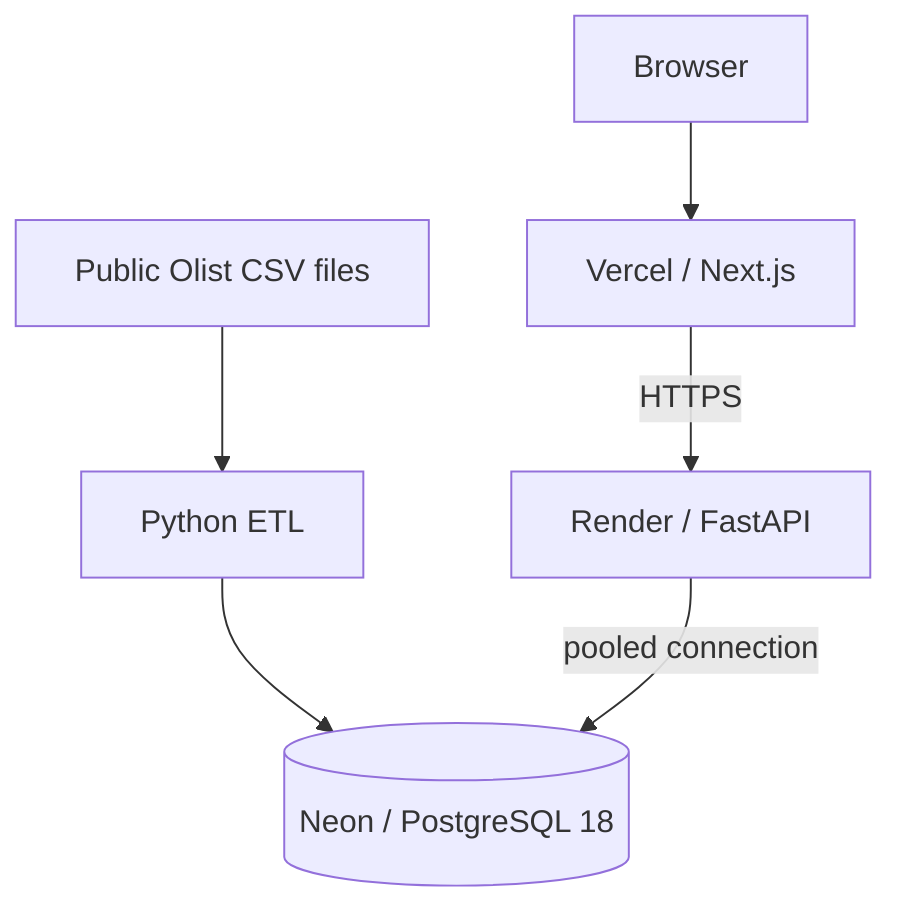

# CommerceIQ

> A SQL-first analytics application for exploring Olist's public e-commerce dataset, from CSV ingestion to browser-based analysis.

[Português](README.md) | [English](README.en.md)

## Demo

**[Open the production application](https://commerce-iq-kappa.vercel.app)** · [API](https://commerce-iq-api.onrender.com/api/v1) · [Health](https://commerce-iq-api.onrender.com/api/v1/health)

The backend runs on Render Free, so the first request after an idle period may take longer while the service starts.

## Overview

The Brazilian E-Commerce Public Dataset by Olist contains roughly 100,000 anonymized historical orders. Its relational files have different grains — orders, items, payments, reviews, and customers — so seemingly simple questions require care to avoid multiplying metrics through joins.

CommerceIQ turns that dataset into a reproducible PostgreSQL analytical model, versioned SQL queries, a read-only FastAPI service, and a bilingual Next.js interface. It is built to examine sales, customers, categories, sellers, retention, and delivery without presenting historical data as Olist's current business performance.


## Available analysis

- Executive overview: KPIs, previous-period comparison, and monthly trends.
- Sales: monthly revenue, month-over-month change, cumulative revenue, and moving average.
- Customers: repeat behavior, purchase sequence, and time between orders.
- Products: category performance and revenue share.
- Sellers: anonymized performance rankings.
- Retention: monthly recurrence cohorts.
- Delivery: delivery timing and its descriptive relationship with review scores.

Public filters include period, customer state, and category. Category labels are localized for PT-BR and EN-US, while the technical API and query-string value stays stable so the selection survives a locale change.

## Technical skills demonstrated

| Area | Evidence in the project |
|---|---|
| Analytical SQL | CTEs, `LAG`, `ROW_NUMBER`, `RANK`, `DENSE_RANK`, `SUM() OVER`, cohort analysis, and `EXISTS` filters. |
| Data modeling and quality | Relational model with constraints, explicit grain definitions, and safeguards against fact duplication in joins. |
| Performance | Indexes tied to read paths and a reproducible `EXPLAIN (ANALYZE, BUFFERS)` procedure. |
| Data engineering | Python ETL that validates CSV contracts, transforms data, loads through Psycopg `COPY`, and uses fingerprints for idempotency. |
| Backend | FastAPI, Pydantic, and Psycopg with typed contracts, bound parameters, and aggregate read-only endpoints. |
| Frontend | Next.js, React, and TypeScript with i18n, URL-backed filters, and loading, empty, and error states. |
| Operations and security | Local Docker Compose; Vercel → Render → Neon deployment; restrictive CORS and a least-privilege PostgreSQL role. |

## Architecture



ETL and migrations use an appropriate administrative role for provisioning and loading. The production API uses only the `commerceiq_app` role, with database `CONNECT`, schema `USAGE`, and table `SELECT`; application transactions are read-only as well. See the [architecture documentation](docs/architecture.md).

## Stack

| Layer | Technologies |
|---|---|
| Database | PostgreSQL 18 |
| ETL | Python 3.12, Psycopg, `COPY` |
| Backend | FastAPI, Pydantic, Psycopg |
| Frontend | Next.js 16, React 19, TypeScript |
| Visualization | Recharts |
| Infrastructure | Docker Compose, Vercel, Render, Neon |
| Quality | Pytest, Ruff, mypy, Vitest, ESLint |

## SQL highlights

Business logic remains in versioned `.sql` files rather than being hidden in application code:

- `LAG()` for time-ordered revenue comparisons and purchase intervals.
- `SUM() OVER()` for cumulative revenue and revenue share.
- `ROW_NUMBER()` for each customer's order sequence.
- `RANK()` and `DENSE_RANK()` for seller and category rankings.
- `EXISTS` to apply category and seller filters to the same item without multiplying facts.

Browse [database/queries](database/queries) and the [SQL analysis map](docs/sql-analysis.md).

## Data pipeline

1. **Extract:** `scripts/download_dataset.py` downloads and extracts only the nine expected files.
2. **Validate:** header contracts and a SHA-256 fingerprint validate input before any database mutation.
3. **Transform:** fields, categories, dates, numbers, and geolocation centroids are normalized.
4. **Load:** Psycopg `COPY` loads tables in relational dependency order through one full-refresh transaction.

A completed fingerprint is skipped; a new fingerprint atomically replaces the analytical dataset. See [docs/data-pipeline.md](docs/data-pipeline.md).

## Security and privacy

- The public API exposes aggregate, read-only analytics only.
- Filter values are validated and passed as bound parameters.
- CORS explicitly allows the public frontend, without wildcards or credentials.
- `commerceiq_app` is separate from the administrative role and has only the privileges needed to read.
- Secrets are supplied through environment variables and are not versioned.
- Customer identifiers, review text, and exact coordinates are not exposed.

See [docs/security.md](docs/security.md) for the threat model and residual risks.

## Run locally

```bash
cp .env.example .env
python scripts/download_dataset.py
docker compose up --build -d
docker compose --profile tools run --rm etl
```

Replace the example passwords and never commit `.env`. Files are downloaded into the Git-ignored `data/raw/` directory.

- Dashboard: `http://localhost:3000`
- API documentation: `http://localhost:8000/docs`
- Health: `http://localhost:8000/api/v1/health`

If local port `5432` is occupied, set `POSTGRES_HOST_PORT` in `.env`; container-to-container traffic remains on `5432`.

## Quality checks

```bash
cd backend && pytest && ruff check . && mypy app
cd ../etl && pytest
cd ../frontend && npm test && npm run lint && npm run build
```

PostgreSQL integration tests use `TEST_DATABASE_URL` when it is configured and cover category-revenue reconciliation, delivery grain, empty periods, and calendar-month gaps.

## Project structure

```text
backend/     FastAPI application and tests
database/    migrations, indexes, roles, and analytical SQL
etl/         source contracts, transformations, and COPY loader
frontend/    Next.js product, i18n, charts, and UI tests
scripts/     dataset download and optional snapshot generation
docs/        technical documentation and decisions
```

## Technical documentation

- [Architecture](docs/architecture.md) · [Database design and ERD](docs/database-design.md) · [Metrics](docs/metrics.md)
- [SQL analysis](docs/sql-analysis.md) · [Data pipeline](docs/data-pipeline.md) · [API](docs/api.md)
- [Performance](docs/performance.md) · [Security](docs/security.md) · [Deployment](docs/deployment.md) · [Technical decisions](docs/technical-decisions.md)

## Limitations

- Source data ends in 2018; growth comparisons are descriptive, not current forecasts.
- Retention means a purchase in a later calendar month, not subscription retention.
- Delivery and review analysis shows association, not causality.
- Revenue uses delivered item prices; freight, discounts, taxes, returns, and platform fees are unavailable.
- Optional snapshot mode fixes its period; the public application uses the live API and full filters.

## Dataset and license

The data comes from the [Brazilian E-Commerce Public Dataset by Olist](https://www.kaggle.com/datasets/olistbr/brazilian-ecommerce), licensed under CC BY-NC-SA 4.0. Raw files are not redistributed by this repository.

CommerceIQ source code is released under the [MIT License](LICENSE).

## Author

Developed by [LuidiC](https://github.com/LuidiC).
