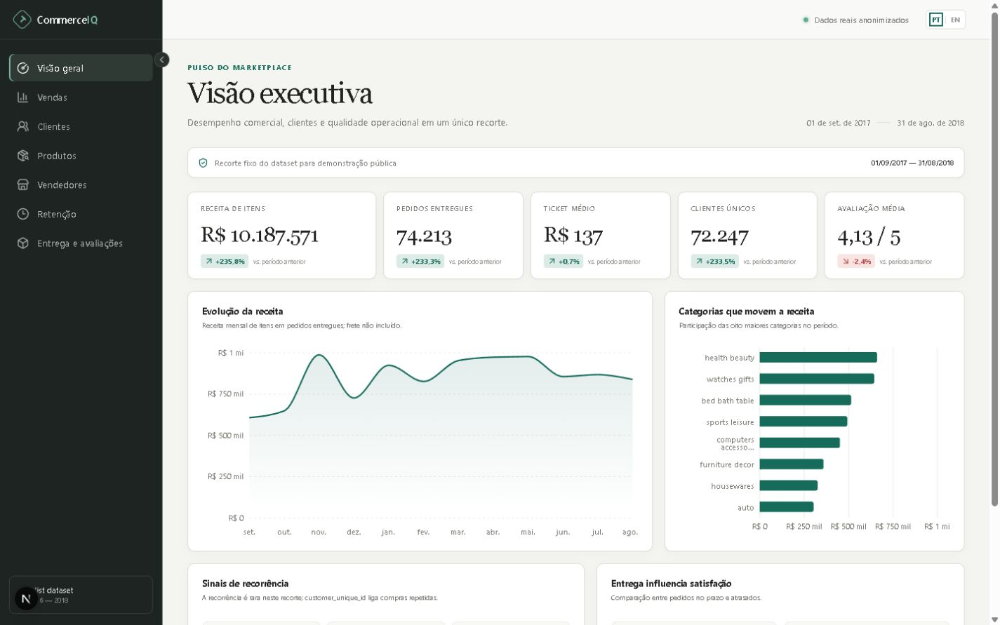
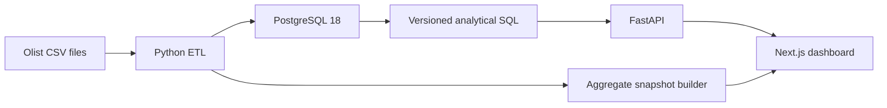

# CommerceIQ

**A SQL-first e-commerce analytics product built from 100,000 real Brazilian marketplace orders.**

CommerceIQ turns the public Olist dataset into a reproducible PostgreSQL analytical model, a typed FastAPI service, and a bilingual Next.js product. A modular monolith keeps the data logic central without adding infrastructure the project does not need.



## Live demo

A public URL is not committed until a real deployment exists. The repository includes two deployment paths: a zero-cost aggregate snapshot for the visual portfolio and a full FastAPI + PostgreSQL stack. See [`docs/deployment.md`](docs/deployment.md).

## The problem

The source dataset is relational but arrives as nine CSV files with entity-specific grain, nullable timestamps, repeated geolocation points, order-level reviews, and order-item revenue. Answering apparently simple questions—monthly revenue, repeat purchase rate, seller performance, delivery impact, or cohort retention—requires explicit metric definitions and careful joins.

## The solution

- A validated, idempotent Python ETL loads the original files into constrained PostgreSQL tables.
- Versioned `.sql` files keep the analytical logic visible and reviewable.
- FastAPI exposes safe aggregate endpoints with bound parameters and typed responses.
- Next.js presents seven focused analysis areas in PT-BR and EN-US.
- A privacy-safe aggregate snapshot provides a fixed-period static demo with inactive filters removed.

## Key features

- Executive KPIs with an equal-length previous-period comparison
- Monthly revenue, Month-over-Month growth, cumulative revenue, and 3-month moving average
- Product/category and seller ranking with window functions
- Repeat-customer rate, purchase sequence, and days between purchases
- Monthly cohort retention matrix
- Delivery timeliness and review-score comparison
- Period, customer-state, and full category filters in the dashboard; seller filtering in the API
- Locale-aware BRL, dates, and numbers in PT-BR and EN-US
- Loading, empty, and safe error states
- Responsive, keyboard-accessible interface and contextual chart descriptions

## Architecture



The snapshot is a hosting adapter generated from real aggregate data. The primary local architecture remains browser → FastAPI → PostgreSQL. See [`docs/architecture.md`](docs/architecture.md).

## Tech stack

| Layer | Technology | Reason |
|---|---|---|
| Database | PostgreSQL 18 | Constraints, analytical SQL, window functions, explain plans |
| ETL | Python 3.12, Psycopg COPY | Small, testable, high-throughput load without orchestration overhead |
| API | FastAPI, Pydantic, Psycopg | Typed read-only boundary while preserving raw SQL |
| UI | Next.js 16, React 19, TypeScript | Mature routing, production build path, strict client types |
| Charts | Recharts | Responsive React composition with deliberate visual customization |
| Operations | Docker Compose | One reproducible local stack, health checks, least-privilege processes |

## Database design

The model retains the useful source grain: one `customers.customer_id` per order, a stable `customer_unique_id` for repeat analysis, composite keys for items/payments, and order-level reviews. Revenue is item price for delivered orders; freight is not included.

Open the [database design and ERD](docs/database-design.md) or inspect [`database/migrations`](database/migrations).

## SQL highlights

- `LAG()` for MoM revenue and time between purchases
- `SUM() OVER()` for cumulative revenue and revenue share
- `ROW_NUMBER()` for customer purchase sequence
- `RANK()` / `DENSE_RANK()` for seller and category performance
- Multiple CTEs for cohort retention and repeat behavior
- `EXISTS` for order-level filters without duplicating facts
- Partial and composite indexes aligned with read paths

All queries are easy to find under [`database/queries`](database/queries), with a study map in [`docs/sql-analysis.md`](docs/sql-analysis.md).

## Running locally

### 1. Configure

```bash
cp .env.example .env
```

Replace both example database passwords. Never commit `.env`.

### 2. Download the dataset

```bash
python scripts/download_dataset.py
```

This downloads the official [Brazilian E-Commerce Public Dataset by Olist](https://www.kaggle.com/datasets/olistbr/brazilian-ecommerce) into the ignored `data/raw/` directory.

### 3. Start and load

```bash
docker compose up --build -d
docker compose --profile tools run --rm etl
```

If host port `5432` is already in use, set `POSTGRES_HOST_PORT` in `.env` to a
free local port. Container-to-container database traffic remains on `5432`.

- Dashboard: `http://localhost:3000`
- API documentation: `http://localhost:8000/docs`
- API health: `http://localhost:8000/api/v1/health`

The ETL fingerprints all source files and skips a completed identical batch.

## Quality checks

```bash
cd backend && pytest && ruff check . && mypy app
cd ../etl && pytest
cd ../frontend && npm test && npm run lint && npm run build
```

Focused tests protect source contracts, transformations, filter validation, SQL path safety, service comparisons, API response shape, locale formatting, and URL query serialization. PostgreSQL-backed integration tests additionally reconcile category revenue, delivery order grain, empty periods, and calendar-month gaps when `TEST_DATABASE_URL` is configured.

## Security and privacy

The public API is read-only and aggregate-only. It uses bound parameters, strict query allowlisting, input limits, statement timeouts, restrictive CORS, safe errors, and a SELECT-only database role. The public snapshot contains no customer identifiers or review text. See [`docs/security.md`](docs/security.md).

## Dataset

The dataset contains roughly 100,000 anonymized orders from 2016–2018. Olist states that identifiers were anonymized and partner/store references in review text were replaced. License: **CC BY-NC-SA 4.0**. Raw files are intentionally excluded from Git.

CommerceIQ analyzes this public sample; it does not claim to represent Olist's full operation, current performance, or Brazilian e-commerce as a whole.

## Project structure

```text
backend/     FastAPI application and tests
database/    schema migrations, indexes, roles, analytical SQL
etl/         source contracts, transformations, COPY loader, tests
frontend/    Next.js product, i18n, charts, UI tests
scripts/     dataset download and aggregate snapshot generation
docs/        architecture, metrics, security, performance, study guide
```

## Limitations

- The source period ends in 2018 and includes an early ramp-up, so prior-period growth is descriptive, not a current business forecast.
- Customer “retention” means a purchase in a later calendar month; it is not subscription retention.
- Delivery/review analysis is associative and does not prove that delay caused the score.
- Product prices are used as gross merchandise revenue; discounts, taxes, returns, and platform fees are unavailable.
- The static hosting mode intentionally fixes the data period. Full filters require the API mode.

## Further reading

- [Architecture](docs/architecture.md)
- [Metrics](docs/metrics.md)
- [Data pipeline](docs/data-pipeline.md)
- [API](docs/api.md)
- [Performance](docs/performance.md)
- [Technical decisions](docs/technical-decisions.md)
- [Study guide and interview questions](docs/study-guide.md)

## License

CommerceIQ source code is released under the [MIT License](LICENSE). The Olist dataset remains under its own CC BY-NC-SA 4.0 license and is not redistributed by this repository.
