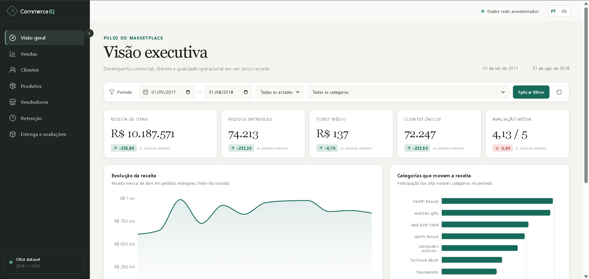
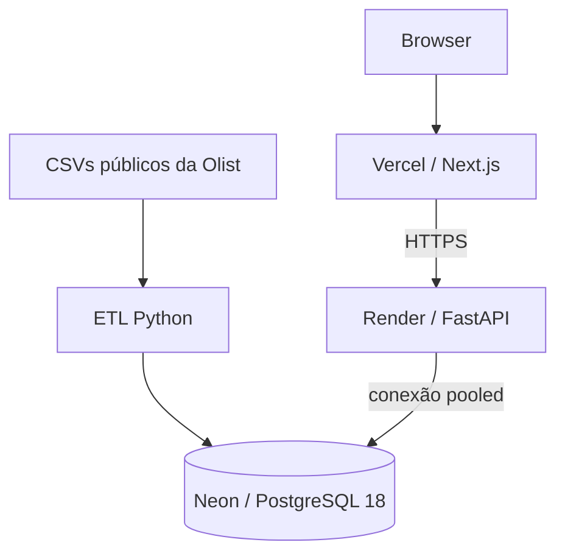

# CommerceIQ

> Aplicação SQL-first para explorar o dataset público de e-commerce da Olist, da carga dos CSVs à análise no navegador.

[Português](README.md) | [English](README.en.md)

## Demo

**[Abrir aplicação em produção](https://commerce-iq-kappa.vercel.app)** · [API](https://commerce-iq-api.onrender.com/api/v1) · [Health](https://commerce-iq-api.onrender.com/api/v1/health)

O backend está no plano Render Free e pode levar mais tempo na primeira requisição após um período sem uso.

## Visão geral

O Brazilian E-Commerce Public Dataset by Olist reúne aproximadamente 100 mil pedidos históricos anonimizados. Seus arquivos relacionais têm grãos diferentes — pedidos, itens, pagamentos, avaliações e clientes — e exigem cuidado para que joins não multipliquem métricas.

Construí o CommerceIQ para transformar esse conjunto em um modelo analítico reproduzível no PostgreSQL, consultas SQL versionadas, uma API FastAPI somente-leitura e uma interface Next.js bilíngue. O objetivo é analisar vendas, clientes, categorias, sellers, retenção e entregas sem tratar os dados históricos como desempenho atual da Olist.



## Análises disponíveis

- Visão executiva: KPIs, comparação com período anterior e evolução mensal.
- Vendas: receita mensal, variação mês a mês, acumulado e média móvel.
- Clientes: recompra, sequência de compras e intervalo entre pedidos.
- Produtos: desempenho e participação por categoria.
- Sellers: ranking anonimizado de desempenho.
- Retenção: coortes mensais de recorrência.
- Entregas: prazo de entrega e relação descritiva com avaliações.

Os filtros públicos incluem período, estado do cliente e categoria. As categorias têm labels localizadas em PT-BR e EN-US; o valor técnico usado pela API e pela query string permanece estável, preservando a seleção ao trocar de idioma.

## Competências demonstradas

| Área                  | Evidências no projeto                                                                                           |
| --------------------- | --------------------------------------------------------------------------------------------------------------- |
| SQL analítico         | CTEs, `LAG`, `ROW_NUMBER`, `RANK`, `DENSE_RANK`, `SUM() OVER`, análise de coortes e filtros com `EXISTS`.       |
| Modelagem e qualidade | Modelo relacional com constraints, definição explícita de grão e prevenção de duplicação de fatos em joins.     |
| Desempenho            | Índices orientados aos caminhos de leitura e procedimento reproduzível com `EXPLAIN (ANALYZE, BUFFERS)`.        |
| Engenharia de dados   | ETL Python com validação de contratos, transformações, Psycopg `COPY` e fingerprint para idempotência.          |
| Backend               | FastAPI, Pydantic e Psycopg com contratos tipados, parâmetros vinculados e endpoints agregados somente-leitura. |
| Frontend              | Next.js, React e TypeScript com i18n, filtros na URL e estados de carregamento, vazio e erro.                   |
| Operação e segurança  | Docker Compose; deploy Vercel → Render → Neon; CORS restritivo e role PostgreSQL de mínimo privilégio.          |

## Arquitetura



O ETL e as migrations usam uma role administrativa apropriada para provisionamento e carga. A API em produção usa somente a role `commerceiq_app`, com `CONNECT`, `USAGE` no schema e `SELECT` nas tabelas; as transações da aplicação também são read-only. Veja [docs/architecture.md](docs/architecture.md).

## Stack

| Camada         | Tecnologias                          |
| -------------- | ------------------------------------ |
| Database       | PostgreSQL 18                        |
| ETL            | Python 3.12, Psycopg, `COPY`         |
| Backend        | FastAPI, Pydantic, Psycopg           |
| Frontend       | Next.js 16, React 19, TypeScript     |
| Visualização   | Recharts                             |
| Infraestrutura | Docker Compose, Vercel, Render, Neon |
| Qualidade      | Pytest, Ruff, mypy, Vitest, ESLint   |

## SQL em destaque

A lógica de negócio permanece em arquivos `.sql` versionados, em vez de ficar escondida na camada de aplicação:

- `LAG()` para comparações de receita e intervalos entre compras.
- `SUM() OVER()` para receita acumulada e participação de receita.
- `ROW_NUMBER()` para a sequência de pedidos por cliente.
- `RANK()` e `DENSE_RANK()` para rankings de sellers e categorias.
- `EXISTS` para aplicar filtros de categoria e seller no mesmo item sem multiplicar fatos.

Consulte [database/queries](database/queries) e o [mapa de análises SQL](docs/sql-analysis.md).

## Pipeline de dados

1. **Extract:** `scripts/download_dataset.py` baixa e extrai somente os nove arquivos esperados.
2. **Validate:** contratos de cabeçalho e fingerprint SHA-256 validam a entrada antes de qualquer mutação.
3. **Transform:** normalização de campos, categorias, datas, números e centróides de geolocalização.
4. **Load:** Psycopg `COPY` carrega as tabelas na ordem de dependências, em uma transação de refresh completo.

Um fingerprint concluído é ignorado; um novo fingerprint substitui o conjunto de dados de modo atômico. Veja [docs/data-pipeline.md](docs/data-pipeline.md).

## Segurança e privacidade

- A API pública expõe apenas análises agregadas e read-only.
- Valores de filtros são validados e enviados como parâmetros vinculados.
- CORS aceita explicitamente o frontend público, sem wildcard e sem credenciais.
- `commerceiq_app` é separada da role administrativa e tem apenas os privilégios necessários à leitura.
- Segredos ficam em variáveis de ambiente e não são versionados.
- Identificadores de clientes, texto de avaliações e coordenadas exatas não são expostos.

Mais detalhes em [docs/security.md](docs/security.md).

## Executando localmente

```bash
cp .env.example .env
python scripts/download_dataset.py
docker compose up --build -d
docker compose --profile tools run --rm etl
```

Substitua as senhas de exemplo e nunca versione `.env`. Os dados são baixados para `data/raw/`, diretório ignorado pelo Git.

- Dashboard: `http://localhost:3000`
- Documentação da API: `http://localhost:8000/docs`
- Health: `http://localhost:8000/api/v1/health`

Se a porta local `5432` estiver ocupada, defina `POSTGRES_HOST_PORT` em `.env`; a comunicação entre containers continua em `5432`.

## Verificações de qualidade

```bash
cd backend && pytest && ruff check . && mypy app
cd ../etl && pytest
cd ../frontend && npm test && npm run lint && npm run build
```

Testes de integração com PostgreSQL usam `TEST_DATABASE_URL` quando configurada e cobrem reconciliação de receita por categoria, grão de entrega, períodos vazios e lacunas mensais.

## Estrutura do projeto

```text
backend/     API FastAPI e testes
database/    migrations, índices, roles e SQL analítico
etl/         contratos de fonte, transformações e carregador COPY
frontend/    produto Next.js, i18n, gráficos e testes de interface
scripts/     download do dataset e geração opcional de snapshot
docs/        documentação técnica e decisões
```

## Documentação técnica

- [Arquitetura](docs/architecture.md) · [Modelo de dados e ERD](docs/database-design.md) · [Métricas](docs/metrics.md)
- [Análises SQL](docs/sql-analysis.md) · [Pipeline de dados](docs/data-pipeline.md) · [API](docs/api.md)
- [Desempenho](docs/performance.md) · [Segurança](docs/security.md) · [Deploy](docs/deployment.md) · [Decisões técnicas](docs/technical-decisions.md)

## Limitações

- O período de origem termina em 2018; comparações de crescimento são descritivas, não previsões atuais.
- Retenção representa uma compra em mês-calendário posterior, não retenção de assinatura.
- A análise de entrega e avaliação mostra associação, não causalidade.
- Receita considera o preço dos itens entregues; frete, descontos, impostos, devoluções e taxas não estão disponíveis.
- O modo snapshot é opcional e fixa o período; a aplicação pública usa a API real e os filtros completos.

## Dataset e licença

Os dados vêm do [Brazilian E-Commerce Public Dataset by Olist](https://www.kaggle.com/datasets/olistbr/brazilian-ecommerce), licenciado sob CC BY-NC-SA 4.0. Os arquivos brutos não são redistribuídos neste repositório.

O código do CommerceIQ é distribuído sob a [licença MIT](LICENSE).

## Autor

Desenvolvido por [LuidiC](https://github.com/LuidiC).
