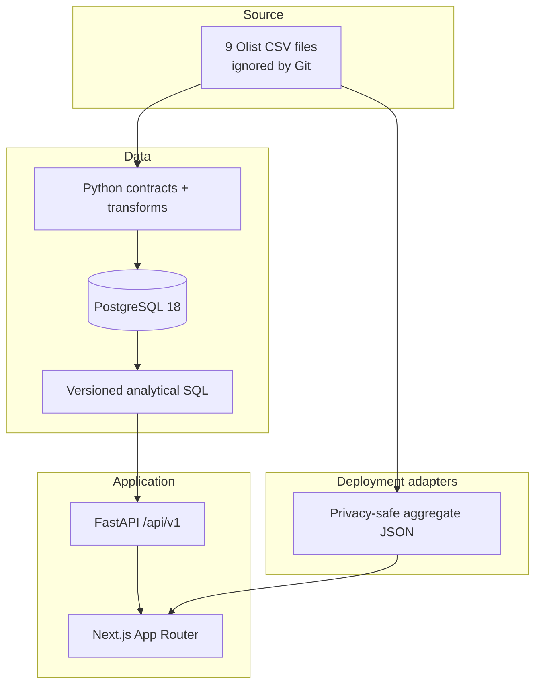

# Architecture

## Overview

CommerceIQ is a modular monolith with four executable concerns: ETL, PostgreSQL, API, and web. The repository keeps ownership explicit while allowing a single Compose stack and a single developer workflow.

## Data flow

1. `scripts/download_dataset.py` downloads and safely extracts only the nine expected files.
2. `etl` validates exact headers and fingerprints file content.
3. Transform functions normalize blanks, numeric values, states, timestamps, categories, and geolocation centroids.
4. A single database transaction truncates and reloads the analytical source model through PostgreSQL COPY.
5. The API selects a query from a fixed allowlist, passes bound filters, validates rows into Pydantic schemas, and returns aggregate JSON.
6. The UI centralizes filters, formatting, remote states, and translations. It never receives raw customer identifiers.

## Responsibilities and dependencies

| Component | Owns | May depend on | Must not own |
|---|---|---|---|
| ETL | source validation, transformation, load batches | source contracts, Psycopg | business presentation |
| Database | integrity, indexes, analytical questions | PostgreSQL | HTTP or UI state |
| API | input validation, orchestration, response contract | database queries | metric reinvention |
| Frontend | presentation, URL filters, i18n, accessibility | API contract | raw dataset processing |

## Important trade-offs

- **Synchronous API:** the portfolio workload is bounded and read-only. A small synchronous connection pool is easier to operate than mixed async code and is sufficient until measurement says otherwise.
- **No ORM:** CRUD is not the product. A thin repository makes SQL inspectable and still guarantees parameter binding.
- **Full refresh ETL:** the public files are immutable snapshots and small enough for one transactional refresh. Incremental watermark logic would add failure modes without source support.
- **No cache service:** static aggregates and platform caching cover the public demo. Redis would duplicate state and operations.
- **Snapshot deployment:** a real-data aggregate file allows a zero-cost visual demo. It is clearly labeled and cannot expose controls that do not recompute data.

## Failure behavior

- Missing or changed CSV headers fail before database mutation.
- A failed load rolls back the dataset and records a failed batch in a separate transaction.
- Unknown query names are rejected before filesystem access.
- Invalid ranges/states/UUIDs return HTTP 422.
- Database/API failures return a stable message without a stack trace.
- The web shows loading, empty, and retryable error states.
