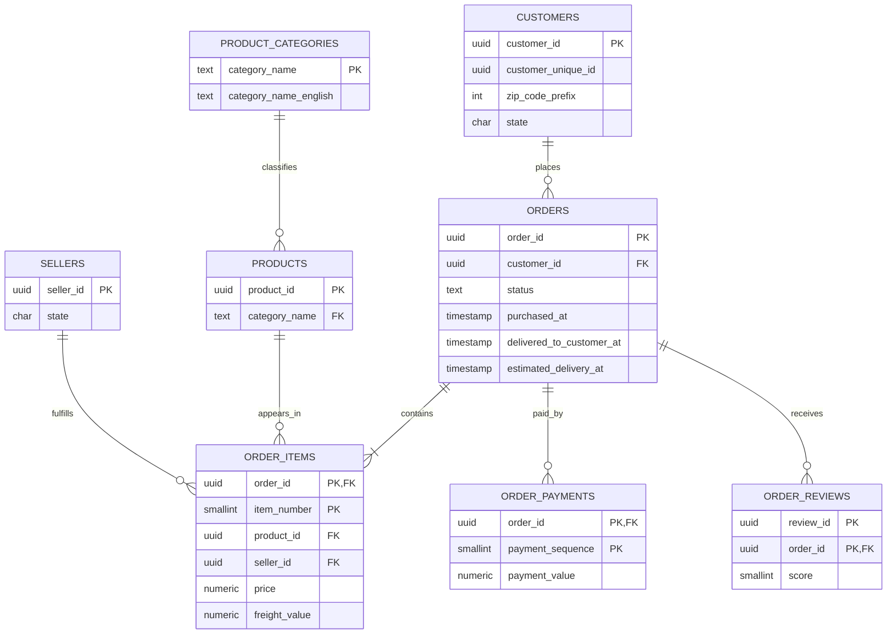

# Database design

## Entity relationship diagram

## Grain and cardinality

- `customers`: one source `customer_id`, which in Olist is order-specific. `customer_unique_id` links that buyer across orders.
- `orders`: one order and exactly one customer record.
- `order_items`: one item sequence within an order. An order can contain different products and sellers.
- `order_payments`: one payment sequence within an order; split payments remain representable.
- `order_reviews`: review/order pairs. The model avoids assuming the review UUID alone is the only possible grain.
- `geolocations`: one representative centroid per ZIP prefix, because the raw source contains repeated coordinate samples.

## Integrity decisions

- Source hexadecimal identifiers are stored as PostgreSQL UUIDs, gaining structural validation and compact indexing.
- Monetary values use fixed-precision `numeric`, never binary floating point.
- State codes and review scores use checks.
- Delivery dates remain nullable because undelivered orders legitimately lack them.
- Status values are constrained to the eight source states.
- A delivered timestamp cannot precede purchase time.

## Normalization

The model is primarily third normal form: customers, sellers, products, categories, orders, items, payments, and reviews each retain their own grain. Category translations are separated because they describe categories rather than products.

No star schema is materialized. At this dataset size PostgreSQL can join the normalized tables efficiently, and keeping one canonical layer avoids a second transformation contract. If concurrency or data volume grew, a documented aggregate/materialized-view layer would be the next step.

## Privacy

Identifiers are technical, anonymized keys. They are required internally for joins and repeat analysis but customer identifiers, review messages, and exact coordinates are not exposed through public endpoints or an optional static snapshot.
