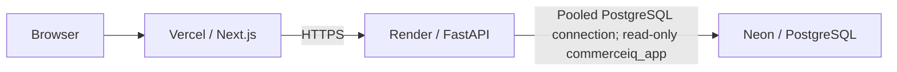

# Deployment

## Current production topology

| Layer | Provider | Public address / role | Operational note |
|---|---|---|---|
| Frontend | Vercel / Next.js | [commerce-iq-kappa.vercel.app](https://commerce-iq-kappa.vercel.app) | Uses live API mode. |
| API | Render / FastAPI | [commerce-iq-api.onrender.com/api/v1](https://commerce-iq-api.onrender.com/api/v1) | Health endpoint: `/api/v1/health`. |
| Database | Neon / PostgreSQL | Private application database | API uses a pooled connection and the read-only `commerceiq_app` role. |

The public frontend is configured with `NEXT_PUBLIC_DATA_MODE=api` and a Render API base URL. It does not use the aggregate snapshot as its primary public data source.

## Environment configuration

Set environment variables in the respective provider settings; do not commit their values or put connection strings in documentation.

| Service | Variables | Notes |
|---|---|---|
| Vercel frontend | `NEXT_PUBLIC_API_URL`, `NEXT_PUBLIC_DATA_MODE` | `NEXT_PUBLIC_*` values are embedded during the Next.js build, so a redeploy is required after changing them. |
| Render API | `APP_DATABASE_URL`, `CORS_ORIGINS`, `LOG_LEVEL` | `APP_DATABASE_URL` is the Neon pooled application connection. `CORS_ORIGINS` includes the stable Vercel origin only; it must not use a wildcard. |

The API service receives no owner or ETL credential. It uses the runtime `commerceiq_app` role, which is granted database `CONNECT`, schema `USAGE`, and table `SELECT`; application transactions are also set read-only.

## CORS and browser access

The FastAPI service allows explicit origins only, permits `GET`, does not accept credentials, and permits only the documented request headers. Production CORS includes `https://commerce-iq-kappa.vercel.app`, allowing the Vercel frontend to call the Render API while rejecting arbitrary browser origins. CORS is not authentication or request-rate protection.

## Render Free cold starts

The Render service uses the Free plan and may spin down after inactivity. The first request after a spin-down can take longer while the service starts; the frontend keeps its loading state and exposes a retryable error rather than replacing live data with a stale snapshot. This deployment is suitable for a portfolio, not a production SLA.

## Provisioning and operational boundaries

Database migrations and the ETL use an appropriate administrative/provisioning role. That role is separate from the API runtime role and must not be configured on Render. The backend Docker build context remains the repository root because `backend/Dockerfile` copies `database/queries` into the image.

Keep secrets only in provider environment settings. Never record database URLs, passwords, tokens, or generated credentials in Git, build logs, or documentation. Preserve Olist attribution and the CC BY-NC-SA obligations.

## Optional static snapshot mode

`scripts/build_demo_snapshot.py` can still generate a privacy-safe aggregate JSON file for a deliberately fixed-period static deployment. It is an alternate adapter, not the production deployment. In that mode, `NEXT_PUBLIC_DATA_MODE` selects snapshot behavior and the UI removes controls it cannot recompute.
